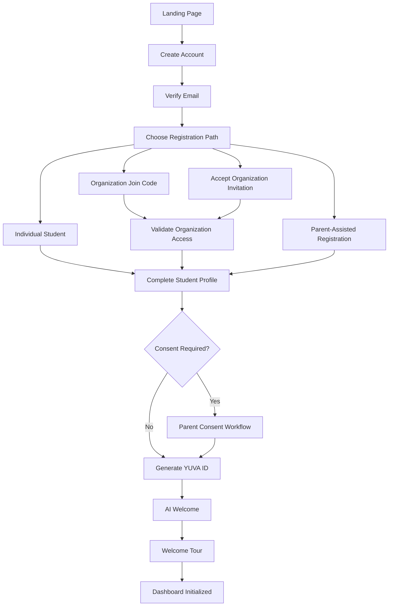

# Volume VIII - Student Platform

# Chapter 1 - Student Registration and Onboarding

## Document Control

| Field | Value |
|---|---|
| Status | Draft Implementation Specification |
| Version | 0.1 |
| Last Updated | July 10, 2026 |
| Primary Owners | Product, UX, Frontend, Backend, Database, Security, AI |
| Source Standard | Product + UX + Frontend + Backend + Database + API + Azure + AI + Security + Test Specification |

## Specification Standard

This chapter follows the YUVA Club Engineering Specification Standard:

- Section A - Business
- Section B - UX
- Section C - Frontend
- Section D - Backend
- Section E - Database
- Section F - APIs
- Section G - Azure
- Section H - AI
- Section I - Security
- Section J - Testing
- Section K - Acceptance Criteria
- Developer Notes
- Product Decisions

## Shared Reference Dependencies

This chapter depends on these shared engineering references:

- [Product Decision Records Standard](../references/01-product-decision-records.md)
- [YUVA UI Design System](../references/02-ui-design-system.md)
- [API Standards](../references/03-api-standards.md)
- [Azure Architecture Standards](../references/04-azure-architecture-standards.md)
- [Azure SQL Database Standards](../references/05-azure-sql-database-standards.md)
- [Security Standards](../references/06-security-standards.md)
- [Coding Standards](../references/07-coding-standards.md)
- [Testing Standards](../references/08-testing-standards.md)
- [AI Standards](../references/09-ai-standards.md)
- [Notification Standards](../references/10-notification-standards.md)

## 1. Executive Summary

Student Registration and Onboarding is the first complete implementation-ready chapter for the YUVA Club Student Platform.

The goal is to let a student create a lifelong YUVA account in less than five minutes while collecting enough information to personalize their learning journey, support consent requirements, connect organization membership when applicable, generate a permanent YUVA ID, and initialize the student's dashboard.

This chapter is not a summary. It is the source specification for building registration and onboarding.

## 2. Founder Intent

YUVA Club should be easy for students to enter and meaningful enough that their first account becomes a long-term leadership identity.

The feature exists because students should not need to wait for a school, nonprofit, or organization to give them permission to begin developing communication and leadership skills. At the same time, organizations need a controlled path to invite students, verify membership, and manage cohorts.

The lifelong YUVA ID matters because students grow across years, schools, cities, organizations, and life stages. Their achievements should travel with them.

Free registration matters because the platform's mission is student-first. Paid organizational features should sustain the business without blocking individual students from joining.

AI matters because onboarding can immediately begin understanding a student's confidence, goals, interests, and learning preferences, then recommend a first useful action.

## 3. Business Purpose

### Goals

- Allow individual students to register for free.
- Allow organization-invited students to join through invitations or join codes.
- Allow parent-assisted registration where a parent creates an account and adds children.
- Generate an immutable lifelong YUVA ID for every student.
- Capture required profile, consent, location, school, organization, learning, and preference data.
- Initialize the dashboard with useful next actions.
- Create audit records for identity, consent, organization linkage, and onboarding events.

### Success Metrics

| Metric | Target |
|---|---|
| Median student registration time | Under 5 minutes |
| Email verification completion | 85 percent or higher |
| Profile completion after first session | 75 percent or higher |
| Organization invite acceptance | 80 percent or higher |
| Parent consent completion when required | 90 percent or higher |
| Onboarding abandonment | Under 20 percent |
| Support tickets per 1,000 registrations | Declining trend after launch |

## 4. Scope

### In Scope

- Individual student registration
- Organization invitation acceptance
- Organization join code flow
- Parent-assisted registration
- Age-based registration rules
- Parent or guardian consent workflow
- YUVA ID generation
- Student profile creation
- Location and school selection
- Organization selection
- Grade and age groups
- Learning interests
- Presentation preferences
- AI preference settings
- Email verification
- Password policies
- Forgot password
- Account recovery
- Profile completion wizard
- First-time user experience
- Welcome tour
- Dashboard initialization
- Error handling
- Validation rules
- Security, privacy, accessibility, and mobile requirements

### Out of Scope

- Full Parent Platform implementation
- Full Student Dashboard implementation beyond initialization
- Full AI Coach implementation beyond onboarding personalization
- Full Organization Admin implementation
- Native mobile app implementation
- Enterprise SSO implementation beyond future design hooks

## 5. User Roles

| Role | Description | Registration Capability |
|---|---|---|
| Individual Student | Student joining without an organization | Can create free account |
| Organization Student | Student joining through an organization invite or code | Can accept invite or enter join code |
| Parent / Guardian | Adult creating or approving a student account | Can create account, add child, approve consent |
| Organization Admin | Authorized organization administrator | Can invite students and issue join codes |
| Master Admin | YUVA internal administrator | Can support account recovery, audit, and exception review |

## 6. Product Decisions

| Decision ID | Decision | Reason | Status |
|---|---|---|---|
| PDR-001 | Students own their achievements | Students may move between organizations | Accepted |
| PDR-002 | Individual registration remains free | Lower adoption barrier | Accepted |
| PDR-003 | Organizations pay for platform capabilities | Sustainable revenue | Accepted |
| PDR-004 | YUVA ID is immutable and never reused | Protect long-term identity integrity | Accepted |
| PDR-005 | Student-led learning drives onboarding | Registration should move students toward action | Accepted |
| PDR-006 | AI is a coach, not a decision maker | AI personalizes onboarding without judging students | Accepted |
| PDR-007 | Multi-tenant architecture | Organization joins must preserve tenant boundaries | Accepted |

## 7. Registration Models

| Model | Entry Point | Primary User | Required Verification | Result |
|---|---|---|---|---|
| Individual Student | Public registration | Student | Email, consent if required | Free student account |
| Organization Invitation | Email invitation link | Student | Invitation token, email, consent if required | Student account linked to organization |
| Organization Join Code | Join code entry | Student | Valid code, email, consent if required | Student account linked to organization or pending approval |
| Parent-Assisted Registration | Parent portal | Parent | Parent email, child info, consent | Student account linked to parent |
| Future SSO | Google, Microsoft, Apple, school SSO | Student | Provider authentication | Student account created or linked |

## 8. UX Specification

### Screen Inventory

| Screen | Purpose |
|---|---|
| Landing Page | Explain YUVA Club and start registration |
| Create Account | Capture email and password |
| Email Verification | Confirm email ownership |
| Registration Path Selection | Choose individual, organization invite, join code, or parent-assisted path |
| Organization Join | Enter join code or accept invitation |
| Student Profile | Capture required student profile fields |
| Parent Consent | Request and capture parent or guardian approval |
| AI Personalization | Ask onboarding questions for learning personalization |
| Welcome Tour | Explain core student actions |
| Dashboard Initialization | Create first dashboard state and next action |

### Journey Flow



### Wireframes

Wireframes should be stored in `docs/wireframes/03-student-platform/registration-onboarding/`.

Required wireframes:

- Landing page layout
- Registration form layout
- Email verification screen
- Organization join screen
- Parent consent screen
- Profile completion wizard
- AI welcome screen
- Welcome dashboard

## 9. Frontend Specification

### Student Profile Fields

| Field | Required | Validation | Notes |
|---|---|---|---|
| First Name | Yes | 2-50 characters | Legal first name or preferred display name depending on policy |
| Last Name | Yes | 2-50 characters | Required for identity and parent linkage |
| Preferred Name | No | 2-50 characters | Used in UI greetings |
| Date of Birth | Conditional | Valid date, not future | Used to determine consent requirements |
| Age | Derived | Calculated | Do not store if derivable unless needed for performance/reporting |
| Grade | Optional/configurable | From configured grade list | Never hard-code grade levels |
| Gender | Optional | From configured options | Include prefer not to say |
| Country | Yes | From configured country table | Never hard-code countries |
| State / Province | Conditional | Depends on country | Cascades from country |
| City | Conditional | Depends on state/province | Cascades from state/province |
| School | Optional/configurable | From school table or free text if allowed | Organization settings may require |
| Organization | Conditional | Required for invite/code path | Can be pending approval |
| Languages | Optional | Multi-select configured languages | Used for localization |
| Profile Photo | Optional | Image type and size rules | Stored in Blob Storage |
| Timezone | Yes | Valid timezone | Default from browser/location |
| Learning Goals | Yes | Multi-select plus optional text | Used for AI personalization |
| Interests | Optional | Multi-select configured topics | Used for recommendations |
| Parent Contact | Conditional | Valid email | Required if consent needed |
| Emergency Contact | Future/configurable | Valid contact fields | Organization-specific |
| Accessibility Preferences | Optional | Configured options | Used for UX adaptation |

### Buttons

| Button | Screen | Behavior |
|---|---|---|
| Create Account | Landing / Registration | Opens account creation or submits account form |
| Verify Email | Email Verification | Submits verification code |
| Resend Code | Email Verification | Sends new code with rate limit |
| Join Organization | Registration Path | Opens join code flow |
| Accept Invitation | Invitation Flow | Validates invitation token |
| Continue | Wizard | Saves current step and advances |
| Back | Wizard | Returns to previous step without losing data |
| Request Parent Consent | Consent | Sends parent consent email |
| Start Tour | Welcome | Opens guided tour |
| Go to Dashboard | Welcome | Finalizes onboarding state |

### Validation Rules

| Field | Rule | Error Message |
|---|---|---|
| Email | Required, valid format, unique | Enter a valid email address that is not already registered. |
| Password | 12+ characters, uppercase, lowercase, number, special character | Password must meet all security requirements. |
| Join Code | Valid, active, not expired, organization allows joins | This join code is invalid or expired. |
| Invitation Token | Valid, unexpired, not already consumed | This invitation link is no longer valid. |
| Parent Email | Required for minor if consent threshold applies | Parent or guardian email is required. |
| Date of Birth | Required when age rules are enabled | Enter a valid date of birth. |
| Country | Required | Select a country. |
| State / Province | Required if configured for country | Select a state or province. |
| Learning Goals | At least one | Choose at least one learning goal. |

## 10. Backend Specification

### Registration Logic

1. Normalize email.
2. Check account uniqueness.
3. Validate password policy.
4. Create pending user account.
5. Send email verification.
6. Verify email token.
7. Determine registration model.
8. Validate invitation or join code if applicable.
9. Create or update student profile.
10. Determine consent requirement.
11. Capture consent or create pending consent request.
12. Generate immutable YUVA ID.
13. Create initial student settings.
14. Create dashboard initialization record.
15. Create audit events.
16. Send welcome and related notifications.

### YUVA ID Generation

Example:

```text
YUVA-US-NY-000015843
```

Rules:

- Immutable
- Never reused
- Unique globally
- Generated only by trusted backend service
- Not user-editable
- Not dependent on mutable organization membership
- Region segment may reflect initial registration geography but must not change if the student moves

### Audit Events

| Event | Trigger |
|---|---|
| USER_REGISTER_STARTED | Account form submitted |
| EMAIL_VERIFICATION_SENT | Verification email sent |
| EMAIL_VERIFIED | Email verification completed |
| STUDENT_PROFILE_CREATED | Student profile created |
| ORGANIZATION_JOIN_ATTEMPTED | Join code or invite used |
| ORGANIZATION_MEMBERSHIP_CREATED | Membership created |
| CONSENT_REQUESTED | Parent consent email sent |
| CONSENT_GRANTED | Parent consent approved |
| YUVA_ID_GENERATED | Lifelong YUVA ID generated |
| ONBOARDING_COMPLETED | Student reaches dashboard |

## 11. Database Specification

### Core Tables

| Table | Purpose |
|---|---|
| Users | Authentication account |
| Students | Student profile and YUVA ID |
| Parents | Parent or guardian profile |
| ParentStudentLinks | Parent-child relationship |
| Organizations | Organization record |
| OrganizationInvitations | Invitation tokens and status |
| OrganizationJoinCodes | Join code definitions |
| StudentOrganizationMemberships | Student membership history |
| ConsentRecords | Consent history |
| StudentPreferences | Learning, AI, notification, accessibility preferences |
| Notifications | Notification records |
| AuditLogs | Immutable audit trail |

### Indexes

| Table | Index | Reason |
|---|---|---|
| Users | UX_Users_Email | Enforce unique email |
| Students | UX_Students_YuvaId | Enforce unique YUVA ID |
| OrganizationInvitations | IX_Invitations_Token | Validate invitation quickly |
| OrganizationJoinCodes | IX_JoinCodes_Code | Validate join code quickly |
| StudentOrganizationMemberships | IX_Membership_Student | Load memberships |
| ConsentRecords | IX_Consent_Student_Status | Determine active consent |
| AuditLogs | IX_Audit_Target_Date | Support audit review |

## 12. API Specification

### POST /api/v1/auth/register

Purpose: Start account registration.

Request:

```json
{
  "email": "student@example.com",
  "password": "ExamplePassword123!",
  "registrationModel": "individual"
}
```

Response:

```json
{
  "userId": "usr_123",
  "status": "email_verification_required"
}
```

Validation:

- Email required, valid, unique.
- Password meets policy.
- Registration model is supported.

Errors:

| Code | Meaning |
|---|---|
| EMAIL_ALREADY_EXISTS | Email is already registered |
| PASSWORD_POLICY_FAILED | Password does not satisfy policy |
| RATE_LIMITED | Too many attempts |

### POST /api/v1/auth/verify

Purpose: Verify email.

### POST /api/v1/student/profile

Purpose: Create student profile.

### PUT /api/v1/student/profile

Purpose: Update profile during onboarding.

### POST /api/v1/organization/join

Purpose: Join an organization using a join code.

### POST /api/v1/consent/request

Purpose: Send parent consent request.

### POST /api/v1/consent/approve

Purpose: Approve consent.

## 13. Azure Specification

| Azure Service | Usage |
|---|---|
| Azure App Service or Container Apps | Host backend API |
| Azure SQL | Store user, student, consent, organization, and audit data |
| Azure Blob Storage | Store profile photos and future onboarding assets |
| Azure Key Vault | Store secrets, signing keys, email provider credentials |
| Application Insights | Track errors, latency, registration funnel, failed joins |
| Azure Communication Services | Send verification, welcome, and consent emails if selected |
| Background Jobs | Send email, process welcome workflow, initialize dashboard |
| Azure OpenAI | AI welcome and personalization, if enabled |

## 14. AI Specification

During onboarding, AI may ask:

- What are your learning goals?
- How confident are you speaking in front of others?
- Have you given a presentation before?
- What subjects do you enjoy?
- What leadership skills do you want to build?
- What communication challenges do you want help with?
- How do you prefer to learn?

AI outputs:

- Confidence baseline
- Initial learning plan
- Suggested first topic
- Recommended first practice activity
- Suggested first dashboard action

AI must not:

- Label the student permanently.
- Make high-stakes judgments.
- Expose private student data to unauthorized users.
- Override consent or privacy rules.

## 15. Security and Privacy

Requirements:

- Passwords are hashed using approved modern password hashing.
- Verification tokens are time-bound and single-use.
- Join codes are rate-limited.
- Invitation tokens are single-use or policy-controlled.
- Consent records are immutable history records.
- Sensitive registration events are audited.
- Bot protection is applied to public registration endpoints.
- Device history is recorded where practical.
- GDPR, COPPA, FERPA, and state privacy requirements are considered in implementation.

## 16. Test Specification

Test cases must cover positive, negative, boundary, security, performance, accessibility, and mobile scenarios.

### Test Matrix Starter

| ID | Category | Scenario | Expected Result |
|---|---|---|---|
| REG-001 | Positive | Student registers with valid email and password | Verification email sent |
| REG-002 | Negative | Duplicate email used | EMAIL_ALREADY_EXISTS |
| REG-003 | Negative | Weak password used | PASSWORD_POLICY_FAILED |
| REG-004 | Boundary | Name is 2 characters | Accepted |
| REG-005 | Boundary | Name is 51 characters | Rejected |
| REG-006 | Security | Too many registration attempts | RATE_LIMITED |
| REG-007 | Organization | Valid join code entered | Membership created or pending approval |
| REG-008 | Organization | Expired join code entered | JOIN_CODE_EXPIRED |
| REG-009 | Invitation | Valid invite accepted | Membership created |
| REG-010 | Invitation | Consumed invite reused | INVITATION_INVALID |
| REG-011 | Consent | Minor requires consent | Consent request sent |
| REG-012 | Consent | Consent approved | Onboarding may continue |
| REG-013 | Consent | Consent withdrawn | Account moves to limited state |
| REG-014 | AI | Student completes AI questions | Learning plan created |
| REG-015 | Accessibility | Form labels are available to screen reader | Pass |

The full chapter must expand this to 100+ test cases before implementation is considered complete.

## 17. Acceptance Criteria

- Student can register as an individual.
- Student can accept an organization invitation.
- Student can join using a valid organization join code.
- Parent can assist registration and approve consent.
- Minor consent rules are enforced.
- Email verification is required before active account use.
- YUVA ID is generated once and never reused.
- Student profile captures required fields and validates them.
- Country, state, city, and school are configurable.
- Learning goals and AI preferences initialize personalization.
- Welcome tour and dashboard initialization occur after onboarding.
- All sensitive events create audit logs.
- APIs validate input and return documented error codes.
- Database tables, indexes, and relationships support the workflow.
- Accessibility and mobile requirements are satisfied.

## 18. Developer Notes

- Never hard-code countries.
- Never hard-code states, cities, or schools.
- Never hard-code grade groups or age groups.
- Never hard-code organization types.
- Never hard-code leadership levels.
- Never hard-code AI prompt text without versioning.
- Never generate YUVA ID on the frontend.
- Never make organization membership the source of student identity.
- Never delete consent history.
- Never allow onboarding to bypass audit logging.

## 19. Codex Implementation Checklist

- Create registration route and form.
- Create email verification workflow.
- Create organization join code workflow.
- Create invitation acceptance workflow.
- Create parent consent request and approval workflow.
- Create student profile wizard.
- Create YUVA ID generation service.
- Create onboarding AI personalization service.
- Create dashboard initialization service.
- Create audit logging for all major events.
- Create API contracts and backend validation.
- Create Azure SQL migrations.
- Create automated tests for registration, consent, joins, and onboarding.
